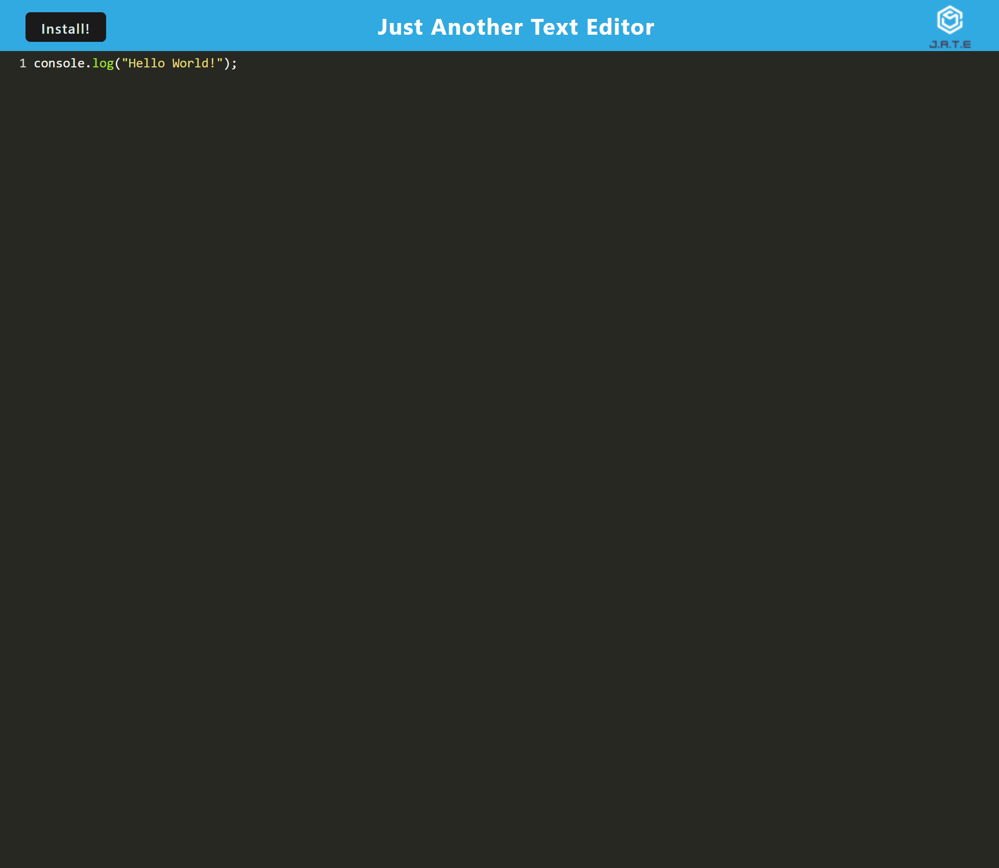

# Text Editor

## Description

This simple text editor was a half-completed project that required me to store persisting data in multiple ways using caching. It also required me to make the project installable on my local machine.

## Usage

Access the application via the deployed Heroku link. It should function like any other coding text editor. If you type something and then click off of the window, it will save the text in the editor and allow you to come back to typing later if you happen to refresh or close the page. Click the "Install!" button to download the application to be used offline.

## Screenshot of Application

## Deployed Heroku Link
